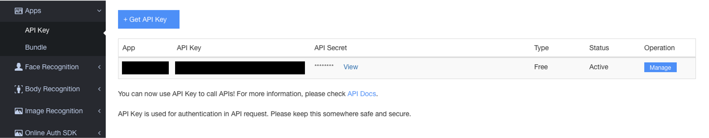
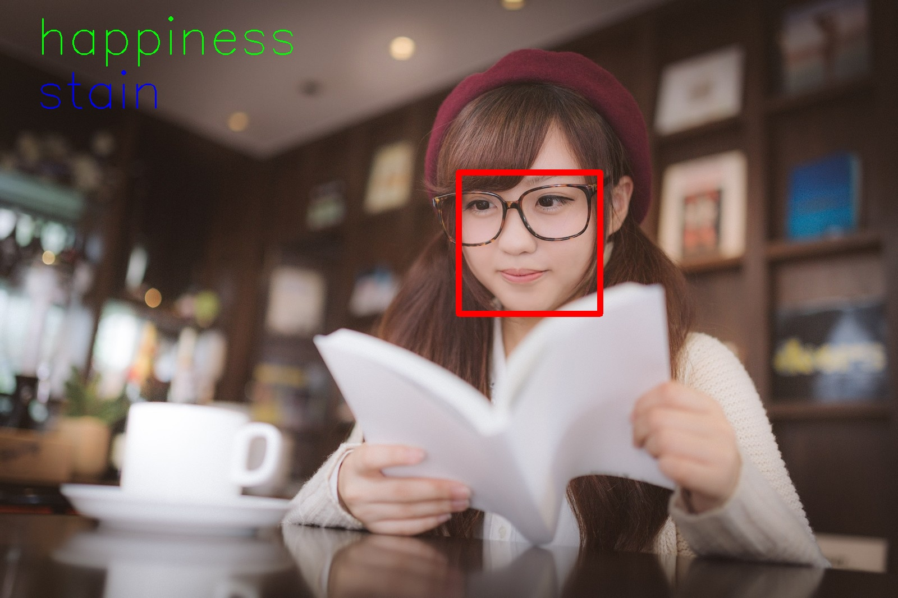
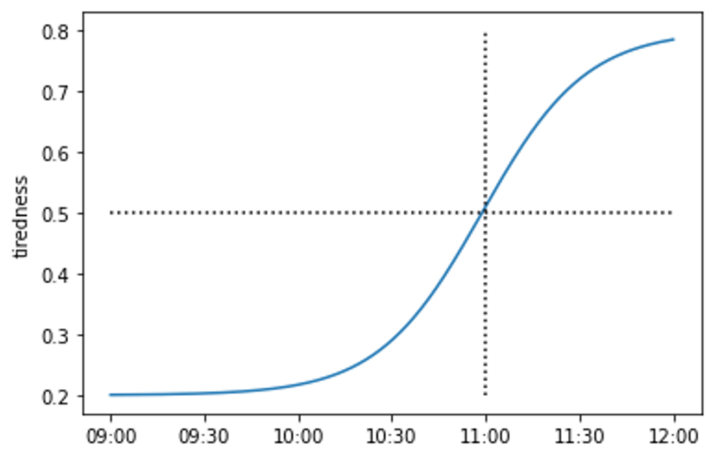

# メニュー

## 概要

疲労度を自身の顔画像から推定し、それをアバターに反映するアプリを作成します。

## 学べること\*

- Face++API の簡単な使い方
- python で AI モデルを作成する方法
- tkinterモジュールを用いて簡単なデスクトップアプリを作成する方法

## 始める前のスキルセット

Python の基本的な知識

## 実務活用例

リモートワークでは相手の状況がわかりにくく、コミュニケーション不足に陥りがちです。このアプリを使えば相手がどれくらい疲れているかが一目でわかり、自然なコミュニケーションにつなげることができます。また、メンタルヘルスケアのためのツールとしても利用できます。

# キッチン

## 開発環境

同じ wi-fi に接続した 2 台の PC

## ツール

- Python3
- Face++

## データセット

- Face++API を使用して、自身の顔の映像をテーブルデータ化したもの

# 調理

## 手順 1: Face++の利用登録

本レシピでは、顔画像から特徴量を抽出するために [Face++](https://www.faceplusplus.com)を利用します。API 使用のために、API Key と API Secret が必要になるため、各自で取得してください。
↓ このように表示されます。


## 手順 2: 疲労度推定モデルの作成

大まかな流れは以下の通りです。

```python
from utils import add_label, collect_data, model, standardize

if __name__ == "__main__":
    # 働きはじめの疲労度を入力
    start = input("tell me how tired you are now(0~1): ")

    # 労働中の顔特徴量を集める
    cap = collect_data.set_cap()
    collect_data.collect_data(cap)
    cap.release()

    # 働き終わりの疲労度を入力
    end = input("tell me how tired you are now(0~1): ")

    # 疲れ始めたタイミングを入力
    beta = input("tell me when you started to feel tired(0~1): ")

    # 入力された値に基づいて労働中の疲労度の推移を近似
    add_label.add_tiredness(START=float(start), END=float(end), BETA=float(beta))

    # 特徴量の正規化
    standardize.standardize_data()

    # 疲労度推定モデルの作成
    model.make_model()
```

以下では、utils 内の各機能の実装を見ていきます。

- collect_data.py

```python
import base64
import json
import os

import cv2
import pandas as pd
import requests

from utils import api
```

以上を import してください。
`utils/api.py` は、API 関連で必要な値を保管しておくファイルで以下のようになっています。

```python
API_KEY = "YOUR API KEY"
API_SECRET = "YOUR API SECRET"
endpoint = "https://api-us.faceplusplus.com"
detect = "/facepp/v3/detect"
```

API_KEY と API_SECRET は、手順 1 で取得したご自身のものを設定してください。今回は Facial Recognition の DetectAPI を使用するので、それに対応した URL を endpoint,detect で設定してあります。

それでは、`collect_data.py` の関数を細かく見ていきましょう。
まずは、`set_cap()`です。カメラを開いて、縦横のサイズを設定しています。今回は 640 x 480 としていますが、必要に応じて変更してください。

```python
WIDTH = 640
HEIGHT = 480

def set_cap():
    cap = cv2.VideoCapture(0)
    if not cap.isOpened():
        print("cam cannot open.")
        exit()
    cap.set(cv2.CAP_PROP_FRAME_WIDTH, WIDTH)
    cap.set(cv2.CAP_PROP_FRAME_HEIGHT, HEIGHT)

    return cap
```

次に、`collect_data()`です。カメラから画像を読み込んで、それを Face++ API を用いて特徴量に変換し、 csv ファイルに書き出しています。

```python
OUTPUT_FOLDER = "./data"

def collect_data(cap):
    frame = 0
    while True:
        frame += 1
        # カメラの画像を読み込む
        ret, img = cap.read()
        if ret:
            # APIに渡す形式に変更
            result, dst_data = cv2.imencode(".jpg", img)
            img_bin = base64.b64encode(dst_data)

            # 写っている顔の数と、特徴量
            num_face, df_tmp = read_img(img_bin, frame)

            if num_face != 0:
                #表示用
                img = set_img(img, df_tmp)

                # res.csvに書き出す
                if os.path.isfile(f"{OUTPUT_FOLDER}/res.csv"):
                    df_tmp.to_csv(f"{OUTPUT_FOLDER}/res.csv", mode="a", header=False)
                else:
                    df_tmp.to_csv(f"{OUTPUT_FOLDER}/res.csv")
                print(frame)

            cv2.imshow("Video", img)
            if cv2.waitKey(1000) & 0xFF == ord("q"):
                break
```

`collect_data()`内で使われている関数も見てみましょう。`read_img()`ではカメラ画像を読み込んだ後、Face++API を使って特徴量に変換し、DataFrame にまとめるところまでを行っています。途中で出て来る`flatten_dict()`は[こちら](https://www.haya-programming.com/entry/2018/08/30/135041)のブログからお借りしました。返ってくる json が結構ネストされていて扱いにくかったので flat にしてから DataFrame に変換しています。

```python
def read_img(img_bin, frame):
    # 画像を送って特徴量を返してもらう
    response = requests.post(
        api.endpoint + api.detect,
        data={
            "api_key": api.API_KEY,
            "api_secret": api.API_SECRET,
            "image_base64": img_bin,
            "return_landmark": 1,
            "return_attributes": "gender,age,smiling,glass,headpose,blur,eyestatus,emotion,facequality,beauty,mouthstatus,eyegaze,skinstatus",
        },
    )
    data = json.loads(response.text)

    df_tmp = None
    if "faces" in data.keys(): # APIのやりとりがうまくいっているか
        if data["faces"]: # 顔が写っているか
            item = flatten_dict(data["faces"][0]).items()
            keys = ["frame"]
            keys += ["_".join(list(i[0])) for i in item]
            value = [[frame]]
            value[0] += [i[1] for i in item]
            df_tmp = pd.DataFrame(value, columns=keys)

    return len(data["faces"]), df_tmp
```

`set_img()`は完全に蛇足なのですが、労働時の様子を撮影しながら何か情報が見えた方が面白いかと思って追加しています。顔の位置を示す長方形と、一番値の高い感情(emotion)および肌の状態(skinstatus)を顔画像に追加しています。
↓ こんな具合になります。(画像は[こちら](https://www.pakutaso.com)のサイトからお借りしています。)


```python
def set_img(img, df):
    row = df.iloc[-1, :]
    # 顔の範囲を描画
    left = row["face_rectangle_left"]
    top = row["face_rectangle_top"]
    right = left + row["face_rectangle_width"]
    down = top + row["face_rectangle_height"]
    cv2.rectangle(img, (left, top), (right, down), color=(0, 0, 255), thickness=10)

    # 感情を表示
    emo = [
        "attributes_emotion_anger",
        "attributes_emotion_disgust",
        "attributes_emotion_fear",
        "attributes_emotion_happiness",
        "attributes_emotion_neutral",
        "attributes_emotion_sadness",
        "attributes_emotion_surprise",
    ]
    emotion = pd.to_numeric(row[emo]).idxmax()[len("attributes_emotion_") :]
    cv2.putText(
        img,
        text=emotion,
        org=(int(WIDTH / 10), int(HEIGHT / 5)),
        fontFace=cv2.FONT_HERSHEY_SIMPLEX,
        fontScale=1.0,
        color=(0, 255, 0),
        thickness=1,
        lineType=cv2.LINE_4,
    )
    # 肌の状態
    skin = [
        "attributes_skinstatus_health",
        "attributes_skinstatus_stain",
        "attributes_skinstatus_dark_circle",
        "attributes_skinstatus_acne",
    ]
    skin_s = pd.to_numeric(row[skin]).idxmax()[len("attributes_skinstatus_") :]
    cv2.putText(
        img,
        text=skin_s,
        org=(int(WIDTH / 10), int(HEIGHT * 2 / 5)),
        fontFace=cv2.FONT_HERSHEY_SIMPLEX,
        fontScale=1.0,
        color=(255, 0, 0),
        thickness=1,
        lineType=cv2.LINE_4,
    )

    return img
```

- add_label.py

```python
import numpy as np
import pandas as pd

from utils import collect_data
```

以上を import してください。
`add_tiredness()`です。入力したパラメータに基づいて各時刻の疲労度を近似し、"tiredness"の列を追加した csv を書き出しています。

```python
def add_tiredness(START: float = 1.0, END: float = 0.0, BETA: float = 0.5):
    # 集めたデータの確認
    df = pd.read_csv(f"{collect_data.OUTPUT_FOLDER}/res.csv", index_col=0)
    length = len(df)

    # 入力したパラメータに基づき疲労度を近似
    df["tiredness"] = tiredness_sigmoid(length, START, END, BETA)

    # 書き出し
    df.to_csv(f"{collect_data.OUTPUT_FOLDER}/res_tiredness.csv")
```

`tiredness_sigmoid()`が実際に近似を行っている関数です。シグモイド関数を利用しており、start=0.2, end=0.8, beta=0.67 とすると、以下のように近似されます。


```python
def tiredness_sigmoid(
    length, start, end, beta, alpha=8
):  # beta 作業時間のうちどのくらいで疲れを感じ始めたか(0~1)
    alpha = 20
    x = np.linspace(-1, 1, length)
    beta = beta * 2 - 1
    y = 1 / (1 + np.exp(-alpha * (x - beta))) * (end - start) + start
    return y
```

- standardize.py

```python
import pandas as pd

from utils import collect_data
```

以上を import してください。
`standardize_data()`です。

```python
def standardize_data():
    # 読み込み
    df = pd.read_csv(f"{collect_data.OUTPUT_FOLDER}/res_tiredness.csv", index_col=0)

    # 正規化
    df = standardize(df)

    # 出力
    df.to_csv(f"{collect_data.OUTPUT_FOLDER}/res_tiredness_std.csv")
```

実際に正規化を行っている`standardize()`を見てみましょう。顔の中心座標と顔の大きさを使って正規化しています。顔の各パーツの位置関係のみで判断するためです。

```python
def standardize(df):
    # 顔の中心座標を計算
    df["center_x"] = df["face_rectangle_left"] + df["face_rectangle_width"] / 2
    df["center_y"] = df["face_rectangle_top"] + df["face_rectangle_height"] / 2

    # 正規化
    df.iloc[:, 6:172:2] = df.iloc[:, 6:172:2].apply(
        lambda x: (x - df["center_x"]) / df["face_rectangle_width"]
    )
    df.iloc[:, 7:172:2] = df.iloc[:, 7:172:2].apply(
        lambda x: (x - df["center_y"]) / df["face_rectangle_height"]
    )

    df = df.drop(["center_x", "center_y"], axis=1)

    return df
```

- model.py

```python
import pickle

import numpy as np
import pandas as pd
import xgboost as xgb

from utils import collect_data
```

以上を import してください。
`make_model()`です。正規化したので、顔の位置を示す座標を削除します。またカテゴリ変数がいくつかあるので、それをワンホットエンコーディングします。その後、今回は時系列データを入力として扱っているため、平均をとってからモデルを学習させます。今回は過去 20 件分のデータの平均を入力としました。モデルは xgboost の回帰モデルを使用しています。

```python
def make_model():
    # 読み込み
    df = pd.read_csv(f"{collect_data.OUTPUT_FOLDER}/res_tiredness_std.csv", index_col=0)

    # 不要な列の削除
    X = df.drop(
        [
            "frame",
            "face_token",
            "face_rectangle_top",
            "face_rectangle_left",
            "face_rectangle_width",
            "face_rectangle_height",
            "tiredness",
        ],
        axis=1,
    )
    y = df.loc[:, ["tiredness"]]

    # カテゴリ変数をワンホットに
    X = ohe(X)

    # 時系列データのため平均をとる
    mean_X = []
    for i in range(19, len(X)):
        mean_X.append(list(X[i - 19 : i + 1].mean().values))
    mean_X = np.array(mean_X)
    y = y[19:]
    mean_X = pd.DataFrame(mean_X, columns=X.columns)

    # モデル作成
    reg = xgb.XGBRegressor()
    reg.fit(mean_X, y)
    pickle.dump(reg, open("./model/model.pkl", "wb"))
```

`ohe()`は以下のようになっています。

```python
def ohe(X):
    # カテゴリ変数をワンホットに
    X["attributes_gender_value_Male"] = X.apply(
        lambda x: 1 if x["attributes_gender_value"] == "Male" else 0, axis=1
    )
    X["attributes_glass_value_Dark"] = X.apply(
        lambda x: 1 if x["attributes_glass_value"] == "Dark" else 0, axis=1
    )
    X["attributes_glass_value_Normal"] = X.apply(
        lambda x: 1 if x["attributes_glass_value"] == "Normal" else 0, axis=1
    )
    X = X.drop(["attributes_gender_value", "attributes_glass_value"], axis=1)

    return X
```

以上でデータ集めとモデル作成は終わりです！

```bash
$ python setup_main.py
```

上記を実行して、しばらく働くとあなたにフィッティングされた疲労度推定モデルが作成されます。
次は、作成したモデルを使って実際に疲労度を推定してみましょう！

## 手順 3: 疲労度の推定

以下が疲労度を推定する`calc_tiredness.py`の全体像です。
モデルを作成した時と同じ要領でカメラ画像を特徴量に変換し、それをモデルに入力することで疲労度を得ています。得られた疲労度を 3 段階にレベルわけ相手の PC に送っています。

```python
import base64
import json
import pickle
from collections import deque

import cv2
import numpy as np
import pandas as pd
import requests

from utils import api, client, collect_data, model, standardize


def calc_level(tiredness):
    if tiredness < 0.33:
        return 0
    elif tiredness < 0.67:
        return 1
    else:
        return 2


if __name__ == "__main__":
    # 相手のPCに繋ぐ
    c = client.connect2server()

    # 記録用ファイル
    f = open(f"{collect_data.OUTPUT_FOLDER}/tiredness.txt", "w")

    # カメラをセット
    cap = collect_data.set_cap()

    # 作成したモデルの読み込み
    reg = pickle.load(open("./model/model.pkl", "rb"))

    # バッファ
    buf_X = deque()
    buf_y = deque()


    frame = 0
    while True:
        frame += 1
        # カメラ画像読み込み
        ret, img = cap.read()

        # APIに渡す形式に変更
        result, dst_data = cv2.imencode(".jpg", img)
        img_bin = base64.b64encode(dst_data)

        # 画像を特徴量に変換
        num_face, X = collect_data.read_img(img_bin, frame)

        if not (X is None):
            # モデルに入れるように整形
            X = standardize.standardize(X)
            X = X.drop(
                [
                    "frame",
                    "face_token",
                    "face_rectangle_top",
                    "face_rectangle_left",
                    "face_rectangle_width",
                    "face_rectangle_height",
                ],
                axis=1,
            )
            X = model.ohe(X)

            # 過去20行分の平均をとって入力
            buf_X.append(X.values[0])
            if len(buf_X) > 20:
                buf_X.popleft()
            tiredness = reg.predict(
                pd.DataFrame([np.array(buf_X).mean(axis=0)], columns=X.columns)
            )[0]

            # 出力も過去10行分を平均した値にする
            buf_y.append(tiredness)
            if len(buf_y) > 10:
                buf_y.popleft()
            output = sum(buf_y) / len(buf_y)

            # ファイル出力
            print(output, file=f)

            # 3段階にレベルわけする
            tired_level = calc_level(output)

            # 相手のPCに送る
            client.send2server(c, tired_level)

            cv2.imshow("video", img)

        if cv2.waitKey(1000) & 0xFF == ord("q"):
            break

    cap.release()
    f.close()
    c.close()
```

相手の PC に送る部分を担っている`utils/client.py`を見てみましょう。`connect2server()`で相手の PC に接続します。`IP`には相手の PC の IP アドレスをセットしてください。`PORT`もなんでも良いですが、相手と揃えてください。そして`send2server()`で相手の PC に値を送ります。

```python
import socket

IP = "YOUR IP"
PORT = 51300

def connect2server():
    c = socket.socket(socket.AF_INET, socket.SOCK_STREAM)
    c.connect((IP, PORT))

    return c

def send2server(c, tiredness):
    tiredness_b = tiredness.to_bytes(4, "big")
    c.send(tiredness_b)
```

以上で実際に疲労度を推定するところまで終了です!

```bash
$ python calc_tiredness.py
```

これを実行することで推定した疲労度を相手の PC に送ることができます。
次は受け取った値を元にアバターを変化させてみましょう。

## 手順 4: アバターの変化

### 下準備

#### 1. gif 画像の取得

はじめに相手の疲労度を反映させるアバターを取得しましょう。今回は[イラスト素材サイト「ぴよたそ」](https://hiyokoyarou.com/)さんの gif 画像を利用させていただきます。
以下の gif ファイルをダウンロードし、新たに gif ディレクトリを作成した上で gif ディレクトリに配置してください。

- [アバター１疲労度小](https://hiyokoyarou.com/flower-dance-gif/)
- [アバター１疲労度中](https://hiyokoyarou.com/aruku-gif/)
- [アバター１疲労度大](https://hiyokoyarou.com/loding-gif/)
- [アバター２疲労度小](https://hiyokoyarou.com/odoru-penguin/)
- [アバター２疲労度中](https://hiyokoyarou.com/tobu-penguin/)
- [アバター２疲労度大](https://hiyokoyarou.com/mimi-furifuri-usagi/)

#### 2. gif 画像サイズの統一: `resize.py`

gif ディレクトリにある全ての gif ファイルのサイズを統一します。今回は 900×700 のサイズにリサイズを行います。

```python
from PIL import Image
import glob

gifs = glob.glob("./gif/*.gif")

for gif in gifs:
    # アニメーションGIFを読み込む
    image = Image.open(gif)

    # アニメーションの各フレームをリサイズしてリストに格納
    resize_image_list = []
    for index in range(image.n_frames):
        image.seek(index)
        resize_image_list.append(image.resize((900, 700)))

    # アニメーションGIFとして書き出し
    resize_image_list[0].save(
        gif,
        save_all=True,
        append_images=resize_image_list[1:],
        loop=0,
    )
```

```bash
$ python resize.py
```

これを実行することで各 gif 画像がリサイズされ、上書き保存されます。
以上で下準備は完了です。それでは実際に gif 画像を表示していきましょう！

### 受信した疲労度に基づくアバター表示: `avatar.py`

#### 1. tkinterのインストール

今回は GUIアプリを簡単に作成することができる tkinterモジュールを用いて、デスクトップアプリの形式でアバターを表示していきます。   
tkinterはOSによっては通常Pythonに含まれていますが、念のため以下のようにインストールが行われているか確認をしておきましょう（linux系では入っていない場合もあるようです）。

```bash
$ Python3
>>> import tkinter
```

もし`ModuleNotFoundError: No module named 'tkinter'`というエラーが出た場合は、以下のコマンドを実行してtkinterをインストールしてください。

```bash
$ sudo apt-get install python3-tk
```

#### 2. アバターを表示するGUIアプリの作成

以下がアバター表示を行う`avatar.py`の全体像です。

```python
import tkinter as tk
from time import sleep
import threading
import socket


class GifPlayer(threading.Thread):
    def __init__(self, path: str, label: tk.Label):
        super().__init__(daemon=True)
        self._please_stop = False
        self.path = path
        self.label = label
        self.duration = []
        self.frames = []
        self.last_frame_index = None
        self.load_frames()

    def load_frames(self):
        frames = []
        frame_index = 0
        try:
            while True:
                frames.append(
                    tk.PhotoImage(file=self.path, format=f"gif -index {frame_index}")
                )
                frame_index += 1
        except Exception:
            self.frames = frames
            self.last_frame_index = frame_index - 1

    def run(self):
        frame_index = 0
        while not self._please_stop:
            self.label.configure(image=self.frames[frame_index])
            frame_index += 1
            if frame_index > self.last_frame_index:
                frame_index = 0
            sleep(0.3)

    def stop(self):
        self._please_stop = True


class TkGif:
    def __init__(self, path, label: tk.Label) -> None:
        self.path = path
        self.label = label

    def play(self):
        self.player = GifPlayer(self.path, self.label)
        self.player.start()

    def stop_loop(self):
        self.player.stop()


# gif画像の疲労度に応じた変更
def update_gif():
    global gif_player
    gif_player.stop_loop()
    gif_player = TkGif(paths[avatar_index][index], label)
    gif_player.play()


# １秒ごとにupdate_gifを実行
def repeat_func():
    update_gif()
    root.after(1000, repeat_func)


# change avatarボタンが押されたとき
def change_avatar():
    n = len(paths)
    global avatar_index
    avatar_index = (avatar_index + 1) % n


# 疲労度を受信
def server():
    global s
    global index
    while True:
        clientsocket, address = s.accept()
        print("connection established!")
        while True:
            data_b = clientsocket.recv(1024)
            if not data_b:
                break
            index = int.from_bytes(data_b, "big")

        clientsocket.close()


if __name__ == "__main__":
    # ソケット通信の準備
    s = socket.socket(socket.AF_INET, socket.SOCK_STREAM)
    PORT = 51300
    s.bind(("0.0.0.0", PORT))
    s.listen(1)

    avatar_index = 0
    index = 0

    # 疲労度の受信を非同期に行う
    thread_server = threading.Thread(target=server)
    thread_server.setDaemon(True)
    thread_server.start()

    paths = [
        [
            "./gif/norinoriflower.gif",
            "./gif/piyopiyo.gif",
            "./gif/loading-hiyoko.gif",
        ],
        [
            "./gif/odorupen.gif",
            "./gif/tobipen.gif",
            "./gif/mimimimi.gif",
        ],
    ]

    # GUIアプリケーションの作成
    root = tk.Tk()
    root.title("remote-avatar")
    root.geometry("900x700")

    main_frame = tk.Frame(root)
    main_frame.pack()

    button = tk.Button(
        main_frame,
        text="change avatar",
        font=("MSゴシック", "11", "bold"),
        width=15,
        justify=tk.LEFT,
        command=change_avatar,
    )
    button.pack()

    gif_player = TkGif(paths[avatar_index][index], label)
    gif_player.play()

    repeat_func()
    root.mainloop()
```   

それでは`avatar.py`のうちtkinterを用いたデスクトップアプリの作成の部分を解説していきます。   

##### 基本構造

tkinterを用いたデスクトップアプリの基本構造は以下のようになっています。

```python
import tkinter as tk

root = tk.Tk()
root.title("remote-avatar")
root.geometry("900x700")

root.mainloop()
```

初めにtkinterのオブジェクト`root`を定義し、これを`mainloop()`メソッドで起動させています。   
オブジェクト`root`のアトリビュートとして、以下の2つは最初に定義されることが多いです。
- `title`: アプリタイトル
- `geometry`: 画面サイズ（幅×高さ）

##### フレームの定義

実は今回の目的であるGUI操作は、先ほど定義したオブジェクト（ウィンドウ）ではなくフレームというものに追加することで初めて実現することができます。   
そこで、以下のようにウィンドウの中にフレームを定義しましょう。   

```python
main_frame = tk.Frame(root)
main_frame.pack()
```

これから追加していくGUI機能は、この`main_frame`に追加していくことになります。   

##### GUI機能の追加

最後に、今回はGUIアプリとして使用頻度の高いボタン機能を追加しましょう。
ボタンの機能を追加するコードは以下の通りです。

```python
button = tk.Button(
        main_frame,
        text="change avatar",
        font=("MSゴシック", "11", "bold"),
        width=15,
        command=change_avatar,
)
button.pack()
```

`tk.Button()`の第1引数には先ほど定義したフレームを指定します。   
また`command`にはボタンが押されたときに実行する関数を指定します。今回はボタンが押された際にアバターの種類を変更する`change_avatar()`という関数を指定しています。

※gif画像をtkinterで表示する方法は長くなってしまうためこちらでは省略します。今回のコードは[こちらの記事](https://qiita.com/osorezugoing/items/b4c845bbd72603e5b5d3)を参考にしているので、是非ご参照ください。

#### 3. 疲労度データ受信

最後に、疲労度の送受信に特に重要な関数`server()`について解説をします。   
`server()`は疲労度の受信を行う、`utils/client.py`の`connect2server()`, `send2server()`に対応した関数です。疲労度を受信する側は相手がいつ疲労度を送信しても受け取れるようにする必要があるため、while 文を利用することで常に受信待ちの状態を実現しています。   
ただし、このままだと`server()`の while ループによって gif 画像表示などの機能が成立しなくなってしまうため、今回は threading モジュールを利用して疲労度の受信を非同期に行うようにしています。

---


以上で疲労度受信とアバター表示の実装は完了です！   
実際に実行確認をする場合は手順2までを完了した上で先に受信側が

```bash
$ python avatar.py
```

を実行し、その後に送信側が

```bash
$ python calc_tiredness.py
```

を実行することで疲労度の送受信、及び疲労度に基づいたアバター表示を行うことができます！

## まとめ

以上でこのレシピは終了です！   
このレシピではAIモデルの作成やデータの送受信、デスクトップアプリの作成まで幅広い内容を含んでいます。   
今回の内容が今後1つでも役に立てば幸いです！
